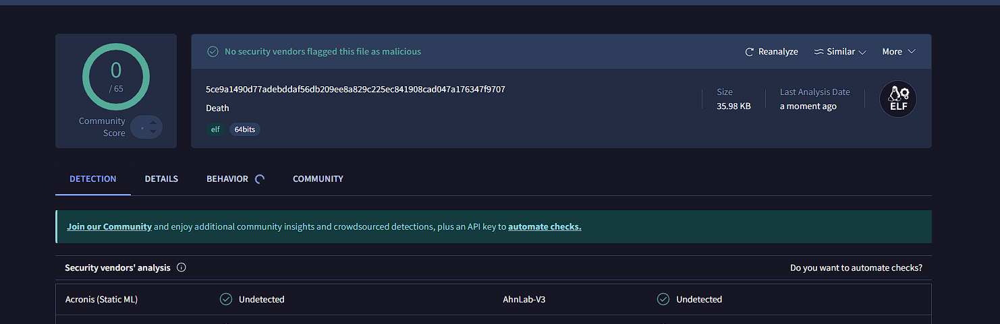

<h1 align="center">
  <a href="https://github.com/jdecorte-be/D34TH"></a>
  D34TH
  <br>
</h1>

<p align="center">
  <a href="https://github.com/jdecorte-be/D34TH">
    
  </a>
  <a href="https://github.com/jdecorte-be/D34TH">
    
  </a>
  <a href="https://github.com/jdecorte-be/D34TH/stargazers">
    
  </a>
</p>

<p align="center">
  <a href="https://github.com/jdecorte-be/D34TH/issues">
    
  </a>
  <a href="https://github.com/jdecorte-be/D34TH">
    
  </a>
  <a href="https://github.com/jdecorte-be/D34TH">
    
  </a>
  <a href="https://github.com/jdecorte-be/D34TH">
    
  </a>
  <a href="https://github.com/jdecorte-be/D34TH">
    
  </a>  
</p>

<p align="center">
  <a href="#key-features">Key Features</a> •
  <a href="#how-to-use">How To Use</a> •
  <a href="#infection-process">Infection Process</a> •
  <a href="#technical-details">Technical Details</a> •
  <a href="#architecture">Architecture</a> •
  <a href="#educational-purpose">Educational Purpose</a> •
  <a href="#license">License</a>
</p>

<div align="center">
  
</div>


---


> **⚠️ PLEASE DON'T BE STUPID: DO NOT RUN THIS ON YOUR SYSTEM. ⚠️**
> 
> This is a **real virus** for educational purposes only.
> 

## Key Features

* **Metamorphic Engine** - Each infection generates unique code variants
  - Dynamic register reassignment and instruction substitution
* **Anti-Debugging Protection** - Multiple evasion techniques
  - Process tracing detection and debugger presence checks
* **ELF64 Binary Infection** - Advanced binary manipulation
  - PT_NOTE to PT_LOAD conversion and header modification
* **RC4 Encryption** - Encrypted payload components
* **Signature Evolution** - Dynamic signature mutation with each infection
* **Process Filtering** - Intelligent target selection and process avoidance
* **Memory Layout Manipulation** - Direct ELF structure modification
* **Polymorphic Transformation** - Register shuffling and junk code insertion
* **Recursive Root Infection** - Systematic propagation from filesystem root
  - Complete filesystem traversal starting from root directory (/)
* **Cross-platform Assembly** - Pure x86_64 assembly implementation


## Project Evolution
Death represents the culmination of my advanced malware research series, building upon the foundational techniques I developed in my predecessor viruses: War, Pestilence, and Famine. This final iteration incorporates the most sophisticated anti-analysis and metamorphic capabilities, making it exceptionally resistant to reverse engineering through advanced instruction substitution techniques. Death inherits and enhances all features from my previous projects, so reviewing my War README.md, Pestilence README.md, and Famine README.md is essential to understanding the complete feature set integrated into this implementation.

## Infection Methodology
This project creates an advanced ELF executable capable of embedding its polymorphic code within target binaries. Death employs a comprehensive recursive infection strategy, systematically traversing the entire filesystem starting from the root directory (/). This approach ensures maximum propagation by discovering and infecting all accessible ELF64 binaries throughout the system hierarchy. A file is considered "infected" when it contains the complete virus payload that executes transparently without altering the host's original functionality or producing detectable output, ensuring stealth operation to avoid security detection.

## Signature Architecture
Post-infection, targeted files contain an evolved signature format: `Death version 1.0 (c)oded by jdecorte-be:alexafer - XXXXXXXXXXXXXXXX:XXXXXXXXXX.XXXXXXXXXX`, where:

- **Infection Index**: Sequential identifier tracking infection propagation order across processes
- **Encryption Key**: Dynamic RC4 key used for payload encryption during each replication cycle  
- **Mutation Signature**: Computed by XORing 32-byte segments of the entire metamorphic payload
- **Temporal Signature**: Timestamp-based component ensuring unique identification per infection

The signature's final component represents a significant advancement over my War methodology. Instead of XORing only the decryptor code (`_virus` to `_decrypt`), Death XORs the complete encrypted and metamorphic payload. This approach ensures that every instruction mutation performed by the metamorphic engine generates a unique signature, creating an evolutionary fingerprint that changes with each code transformation cycle.

## Series Evolution
Death inherits comprehensive capabilities from my previous virus implementations including debugger detection mechanisms, decryptor mutation algorithms, recursive root filesystem infection, and advanced evasion techniques. The complete technical foundation requires understanding the architectural evolution documented in my War, Pestilence, and Famine README files to fully comprehend Death's integrated feature matrix.


## How To Use
To compile and run this educational virus, you'll need [NASM](https://www.nasm.us/) and [GCC](https://gcc.gnu.org/) installed on a Linux x86_64 system. **IMPORTANT: Only run in isolated virtual machines.**

```bash
# Clone this repository
$ git clone https://github.com/jdecorte-be/D34TH

# Go into the repository
$ cd D34TH

# Build the virus
$ make

# Run in isolated environment ONLY
$ ./Death
```


## Infection Process

<details open>
<summary>1. <strong>Target Discovery</strong></summary>

The virus initiates a recursive scan of the filesystem, beginning at the root directory (<code>/</code>). It systematically explores subdirectories and examines each file encountered. For each file, the virus checks:
<ul>
  <li>If it is an ELF64 binary (Linux 64-bit executable format)</li>
  <li>If the file is not in a filtered list (e.g., security tools and known analysis programs are skipped)</li>
  <li>If the file is not already infected (by searching for its unique evolutionary signature)</li>
</ul>
This process ensures that only new, valid, and suitable binaries are considered for infection.
</details>

<details open>
<summary>2. <strong>Binary Analysis</strong></summary>

Once a potential target is found, the virus parses the ELF header and segment tables of the binary. The analysis includes:
<ul>
  <li>Verifying the ELF magic bytes and architecture (ELF64)</li>
  <li>Checking for existing infection signatures to avoid reinfection</li>
  <li>Ensuring the binary is writable and executable (suitable for code injection)</li>
  <li>Locating an appropriate segment (e.g., converting a <code>PT_NOTE</code> to <code>PT_LOAD</code>) for payload injection</li>
</ul>
This step is critical for maintaining host stability and for stealth, since the virus avoids corrupting binaries or overwriting crucial data.
</details>

<details open>
<summary>3. <strong>Code Generation (Metamorphic Mutation)</strong></summary>

For every infection attempt, the virus mutates its payload, creating a new, functionally equivalent but bytewise-unique variant. Mutation strategies include:
<ul>
  <li>Register reassignment (changing which registers are used by the code)</li>
  <li>Instruction substitution (e.g., replacing <code>ADD</code> with <code>SUB</code> or using different ways to clear a register)</li>
  <li>Junk and NOP code insertion to further obfuscate the payload</li>
</ul>
This process hinders static detection and reverse engineering, as every infection results in a different binary code sequence.
</details>

<details open>
<summary>4. <strong>Header Modification</strong></summary>

The virus alters the ELF headers to ensure its payload is executed first. Actions include:
<ul>
  <li>Updating the binary's entry point (<code>e_entry</code>) to point to the injected payload</li>
  <li>Modifying or creating a program segment (e.g., <code>PT_LOAD</code>) to contain the payload and ensure it is marked executable</li>
</ul>
After the payload runs, it jumps to the original entry point so the host program behaves as expected, maintaining stealth.
</details>

<details open>
<summary>5. <strong>Payload Injection</strong></summary>

The mutated payload is encrypted using RC4 with a unique key for every infection. The virus then:
<ul>
  <li>Injects the encrypted payload into the chosen segment of the binary, without overwriting the host's original code</li>
  <li>Ensures the payload is mapped into memory for execution</li>
  <li>Preserves the host functionality and output, so the infection remains undetectable during normal use</li>
</ul>
</details>

<details open>
<summary>6. <strong>Signature Evolution</strong></summary>

After a successful infection, the virus appends a unique signature to the infected file. This signature contains:
<ul>
  <li>An infection index to track propagation order</li>
  <li>An RC4 encryption key fragment used for this instance</li>
  <li>A mutation signature, generated by XORing 32-byte chunks of the payload (covering all code, not just the decryptor)</li>
  <li>A timestamp-based value for additional uniqueness</li>
</ul>
This signature prevents double-infection, tracks mutation lineage, and is unique for every infected binary.
</details>

<p><strong>Summary:</strong><br>
D34TH discovers and analyzes ELF64 binaries, generates a new metamorphic and encrypted payload for every infection, modifies ELF headers, injects the payload without disrupting the host's behavior, and marks the infected file with a unique evolving signature.
</p>
</details>


---

## Architecture

The virus consists of several key components:

- **[Death.s](src/Death.s)** - Main virus entry point and control logic
- **[Death.inc](src/Death.inc)** - System call definitions and data structures  
- **[Deathf.s](src/Deathf.s)** - File system traversal and infection routines
- **[rc4.s](src/rc4.s)** - RC4 encryption implementation
- **[encrypt_start.s](src/encrypt_start.s)** - Encrypted payload section
- **[functions/](src/functions/)** - Modular infection and utility functions:
  - `infection.s` - Core binary infection logic
  - `prepare_infection.s` - Pre-infection validation and setup
  - `check_forbidden.s` - Process filtering and detection avoidance
  - `updata_signature.s` - Signature evolution mechanisms
  - `parse_dir.s` - Directory parsing utilities
- **[Makefile](Makefile)** - Build system with encryption integration

## VirusTotal Analysis

For transparency and educational value, here is a sample VirusTotal analysis of a compiled binary from this project.  
**Note:** Detection rates may vary depending on metamorphic mutations and the scanning date.

- [VirusTotal report link](https://www.virustotal.com/gui/file/5ce9a1490d77adebddaf56db209ee8a829c225ec841908cad047a176347f9707)
- **Detection Ratio:** 0/65 (as of June 2025)
</img>

## License

**Educational and Research Use Only** - See project files for detailed terms.

**⚠️ DISCLAIMER**: The authors provide this code solely for educational purposes. Users are responsible for ensuring compliance with applicable laws. The authors disclaim all liability for misuse or damage.

<div align="center">

> [42 School](https://42.fr) &nbsp;&middot;&nbsp;
> GitHub [@jdecorte-be](https://github.com/jdecorte-be)

</div>
